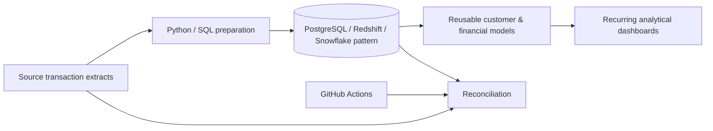

# Banking Warehouse Performance & Reconciliation Automation

A synthetic financial-data project demonstrating **warehouse SQL design, recurring query optimization patterns, reusable reporting datasets, and automated source-to-target reconciliation**.

> The repository uses synthetic transactions and generic schemas. It contains no bank/customer production data or employer code.

## Architecture



## What is implemented

- synthetic customer/transaction data;
- Python control-total and transaction-set reconciliation;
- portable star-schema SQL;
- reusable monthly customer aggregation query;
- window-function example for rolling metrics;
- documentation explaining warehouse-specific performance considerations;
- CI validation.

## Run locally

```bash
python -m venv .venv
# activate environment
pip install -r requirements.txt
pytest -q
python src/reconcile.py --source data/source_transactions.csv --target data/warehouse_transactions.csv
```

## Reconciliation controls

The automated control checks:

- source and target row counts;
- source and target transaction-ID sets;
- amount control totals;
- duplicate transaction IDs.

## SQL folders

- `01_star_schema.sql` — portable dimensional model skeleton
- `02_optimized_customer_summary.sql` — pre-aggregation + rolling metrics
- `03_reconciliation.sql` — simple warehouse-side controls

## Technologies represented

Python · SQL · PostgreSQL · Amazon Redshift · Snowflake · Query Optimization · Dimensional Modeling · Data Reconciliation · Data Validation · GitHub Actions

## Author

**Nithin Konjeti** — Data Engineer  
[Portfolio](https://applywizz-nithinkonjeti-36111.vercel.app/) · [LinkedIn](https://www.linkedin.com/in/nithin-konjeti/)
