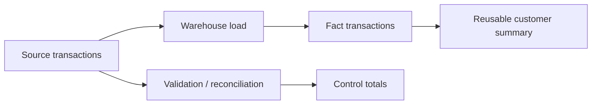

# Banking Warehouse Performance & Reconciliation Automation

A synthetic banking data-engineering project demonstrating **source-to-target reconciliation, reusable reporting datasets, star-schema concepts, and query-optimization patterns**.

## Verified local workflow

```bash
python src/reconcile.py --source data/source_transactions.csv --target data/warehouse_transactions.csv
python src/build_demo_warehouse.py
python -m unittest discover -s tests -v
```

`build_demo_warehouse.py` creates a temporary/local SQLite warehouse, loads synthetic transactions, executes an indexed customer summary query, and prints the result.

## Architecture



## Reconciliation controls

- row counts;
- transaction-ID set equality;
- duplicate IDs;
- amount control totals;
- required-column validation;
- invalid numeric amount detection.

## SQL examples

- [`sql/01_star_schema.sql`](sql/01_star_schema.sql): generic warehouse design
- [`sql/02_optimized_customer_summary.sql`](sql/02_optimized_customer_summary.sql): recurring monthly summary and rolling metric pattern
- [`sql/03_reconciliation.sql`](sql/03_reconciliation.sql): warehouse control totals
- [`sql/sqlite_demo.sql`](sql/sqlite_demo.sql): executable local/indexed example

See [`docs/OPTIMIZATION.md`](docs/OPTIMIZATION.md) for performance reasoning and portability notes across PostgreSQL, Redshift, and Snowflake.

## Author

**Nithin Konjeti** — Data Engineer  
[Portfolio](https://applywizz-nithinkonjeti-36111.vercel.app/) · [LinkedIn](https://www.linkedin.com/in/nithin-konjeti/)
